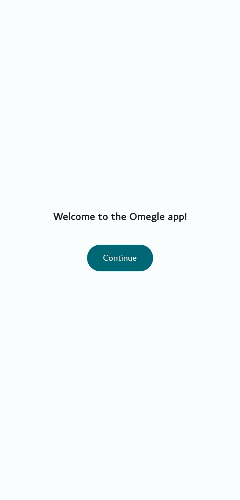
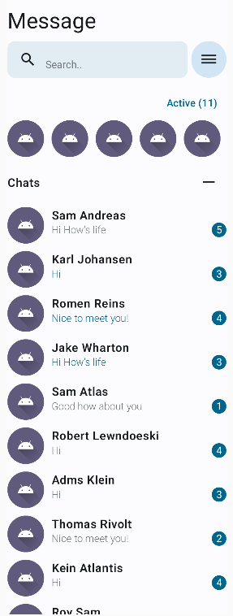
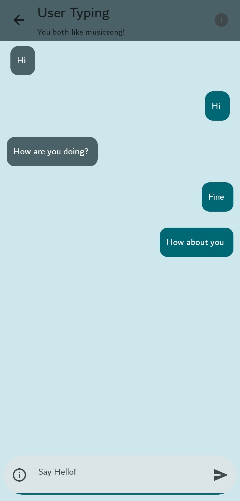

# OmegleChat

A new Android client for the [Omegle website](https://www.omegle.ecom).

## Features
- [ ] Block Users
- [ ] Block keywords
- [ ] Better Design
- [x] Stored preferences

## Showcase

     &nbsp;
     &nbsp;
     &nbsp;
     &nbsp;
     &nbsp;

## Installation

Clone the project locally and build it, or install the APK file from the [releases section](https://github.com/z0xyz/omeglechat/releases).

## Contributing

Pull requests are welcome. For major changes, please open an issue first
to discuss what you would like to change.

## License

[MIT](./LICENSE)
